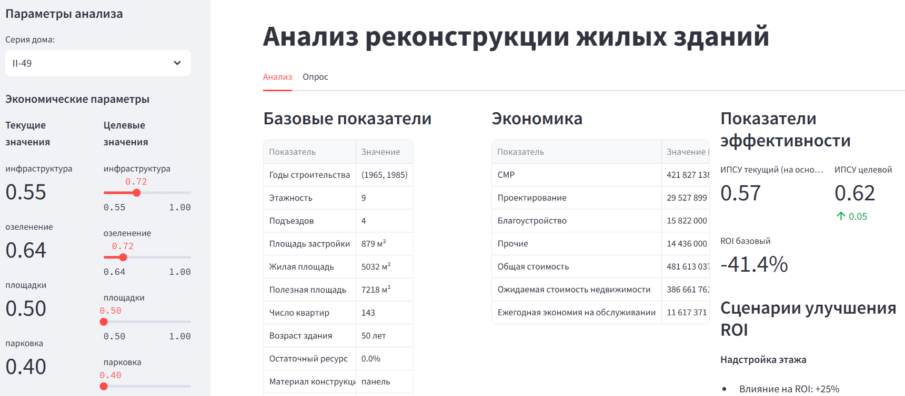

# Анализ реконструкции жилых зданий

Концепт анализа экономической эффективности реконструкции жилых зданий различных серий.


## 📊 Функциональность

### Анализируемые серии домов:

- **II-49** (1965-1985): 9 этажей, 143 квартиры
- **П-44** (1978-2000): 17 этажей, 64 квартиры
- **1-464** (1958-1963): 5 этажей, 80 квартир

### Ключевые метрики:

- Экономические показатели (СМР, ROI, срок окупаемости)
- ИПСУ (Индекс потребительской удовлетворенности)
- Приоритет реконструкции
- Прогноз затрат на обслуживание
- Энергоэффективность

## 🛠 Установка и запуск

### 1. Установка зависимостей

```bash
pip install -r requirements.txt
```

### 2. Запуск приложения

```bash
streamlit run app.py
```

### 3. Открытие в браузере

Приложение автоматически откроется по адресу: `http://localhost:8501`

## ⚡ Оптимизации производительности

### Кэширование

- `@lru_cache` для часто вызываемых функций
- `@st.cache_data` для кэширования данных Streamlit
- Кэширование экземпляра анализатора

## 📈 Использование

1. **Выбор серии дома** - выберите анализируемую серию из выпадающего списка
2. **Настройка параметров** - установите целевые значения удовлетворенности
3. **Анализ результатов** - просмотрите экономические показатели и графики
4. **Сравнение сценариев** - изучите различные варианты реконструкции

## 📝 Лицензия

MIT License - свободное использование и модификация.
